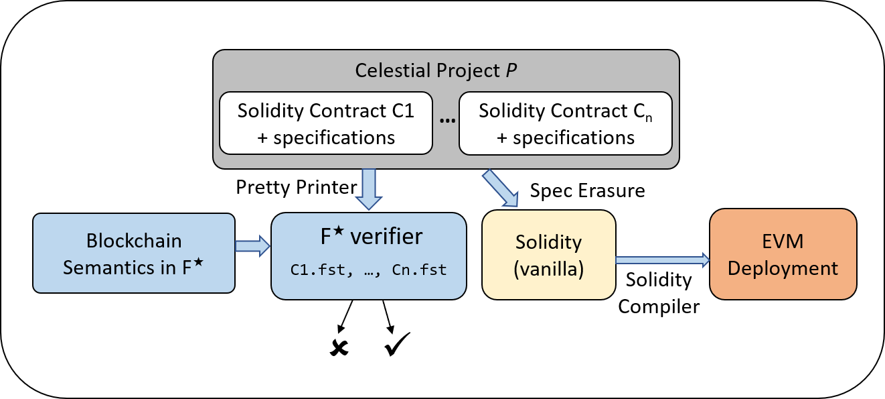

# Celestial

Celestial is a framework to develop formally verified smart contracts written in the Solidity language for the Ethereum blockchain. Celestial allows programmers to annotate smart contracts with expressive functional specifications. It translates the contracts and their specifications to F\* and (automatically) formally verifies that the contract meets these specifications, against an F\* model of the blockchain semantics. Once the verification succeeds, Celestial erases these specifications to generate Solidity code for execution on the Ethereum blockchain. The image shows the architecture of the Celestial framework:



We demonstrate Celestial by verifying several real-world smart contracts from different application domains such as tokens, digital wallets, etc.

<hr \>

## Repository Structure

The repository consists of the following directories:
* `Compiler/`: Contains the source for the prettyprinters
* `Compiler/lib/`: Contains F* and Solidity libraries
* `Samples/`: Contains the contracts we verified, with a subdirectory for each contract
* `Contract_Telemetry/`: Contains scripts used to obtain contract telemetry

<hr \>

## Installation

Celestial requires the following tools:
* **F***: See [this](https://github.com/FStarLang/FStar/blob/master/INSTALL.md) to install F*.
* **Python 3**: See [this](https://www.python.org/downloads/) to install Python 3
* **ANTLR 4**: See [this](https://www.antlr.org/download.html) to install ANTLR

The Celestial prettyprinters require the following python packages to be installed:
* **antlr4**: `pip install antlr4-python3-runtime`
* **prettytable**: `pip install PrettyTable`
* **argparse**: `pip install argparse`

<hr \>

## Usage
### Instructions to compile a Celestial source:
```sh
$ python3 ./main.py <path_to_celestial_source_code> [--fstDir="path_to_output_directory_for_FStar_code"]
[--solDir="path_to_output_directory_for_Solidity_code"] 
```

The F\* code will be generated in the current directory (if `fstDir` is not specified) with the same name as the contract. The Solidity file will be named `contract.sol`.

### Instructions to verify the generated code using F\*
```
fstar --include ../Compiler/lib [--z3rlimit 50] <path_to_generated_FStar_code>
```
One can increase ```z3rlimit``` if required. More details about F* can be found [here](https://github.com/FStarLang/FStar).

### Platform

We have tested Celestial on Ubuntu running on Windows 10, via the Windows Subsystem for Linux. The tool should run as intended on other flavors of Linux, and MacOS.

<hr \>

## Contribution / Issues

Celestial is under development. Please contact [Suvam](mailto:sumukherjee@microsoft.com) or [Samvid](mailto:t-sadha@microsoft.com) in case of any bugs or feature requests.

<hr \>

## License
Celestial is released under the MIT license.